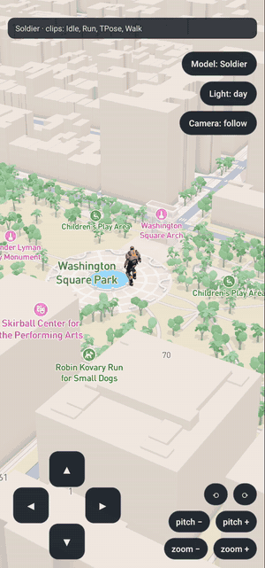
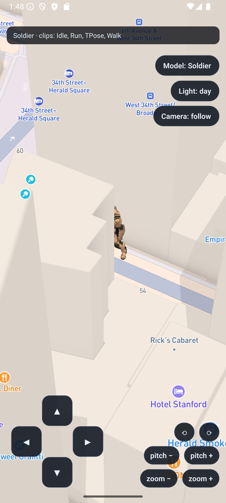
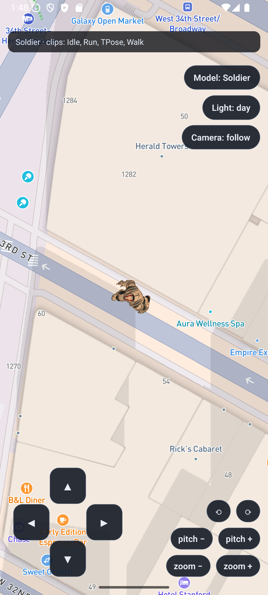

# expo-mapbox-animated-character

**Animated, skinned glTF/GLB characters on a native Mapbox map in React Native / Expo — occluded by the map's own 3D buildings.**

Mapbox's model layer [does not support glTF animation](https://docs.mapbox.com/style-spec/guides/using-3d-models/#limitations):

> No support for glTF animations (key frame animations, skinning, or morph targets)

Their suggested workaround — a custom layer running three.js — only exists on the web.
Ask for the same thing in React Native and the answer has been
[a flat no](https://github.com/rnmapbox/maps/discussions/4146). So if you want a
Pokémon-GO-style avatar that idles, walks, turns to face travel, and disappears behind
skyscrapers, there has been no path.

This library is that path. It renders a skinned GLB inside Mapbox's own GL frame via
`CustomLayerHost`, sharing the map's depth buffer, with no 3D engine dependency — no
three.js, no Filament, no Sceneform. Just a GLB parser and an OpenGL ES 3.0 renderer
in about 2,300 lines of Kotlin.

<p align="center">
  
</p>

That is the bundled example app, recorded off a device — not a mockup. The character
walks out of the park, **disappears behind the buildings** on Washington Square North,
walks back into the open, and the light preset switches to dusk. Idle and walk clips
cross-fade as it starts and stops.

<details>
<summary>Closer look at the depth test</summary>

| Occluded by a building | Standing in the street |
| --- | --- |
|  |  |

Two stills from a denser part of Manhattan. In the left one the building edge cuts
straight through the character — that is the map's own depth buffer doing the work, not
a sprite drawn on top.

</details>

**Android only.** See [Limitations](#limitations) before you invest.

---

## What you get

- **Real skeletal animation** — linear blend skinning, up to 64 joints, glTF
  `translation`/`rotation`/`scale` channels with `LINEAR`/`STEP` interpolation and
  quaternion slerp.
- **Cross-fading between clips** — switching idle → walk eases over ~0.28 s instead of
  snapping.
- **Genuine depth occlusion** — the character is drawn in the map's depth window, so a
  building in front of it hides it, and one behind it does not.
- **Jitter-free camera lock** — an anchoring mode that pins the model to each frame's
  camera centre, so a followed character can never desync from the map by a frame.
- **Lighting that matches the basemap** — `day`/`dawn`/`dusk`/`night` rigs to track the
  Standard style's `lightPreset`, with sRGB-correct decode, hemisphere ambient, and
  soft highlight rolloff.
- **Materials** — base colour textures and factors, vertex colours, normal maps
  (including models with no `TANGENT` attribute), emissive, `OPAQUE`/`MASK`/`BLEND`
  alpha modes, glTF sampler wrap modes, mipmapping.
- **A config plugin** that copies your `.glb` files into the Android assets folder on
  every `expo prebuild`.

## Requirements

| | |
| --- | --- |
| Platform | Android only (OpenGL ES renderer) |
| Peer dependency | [`@rnmapbox/maps`](https://github.com/rnmapbox/maps) v10+ |
| Workflow | Expo with native code (`expo prebuild` / dev build). Expo Go cannot load custom native modules. |
| Mapbox token | A **public** token (`pk.…`) for runtime. A secret downloads token is no longer required. |
| Model | Any `.glb` with a skin and at least one animation clip. |

## Try the example in five minutes

The example ships with both demo models already committed, so this works on a fresh
clone with no asset hunting:

```bash
git clone https://github.com/gauthamvr/expo-mapbox-animated-character.git
cd expo-mapbox-animated-character/example

cp .env.example .env
# edit .env and paste your public Mapbox token (pk.…)

npm install
npx expo run:android      # device or emulator, first build takes a few minutes
```

You get the view in the GIF above: a 22 m soldier standing in Washington Square Park.
Hold the D-pad to walk — the walk clip fades in, the character turns to face travel, and
walking north takes it behind the buildings. The park is deliberate: somewhere dense
like Midtown demonstrates occlusion but hides the character almost continuously, which
shows you nothing. The chips on the right switch model (Soldier ↔ Fox), cycle the light
preset, and flip between follow-camera and free-camera anchoring.

If the app opens on a "Mapbox access token missing" screen, your `.env` was not picked
up — restart the bundler after creating it.

## Use it in your own app

```bash
npm install expo-mapbox-animated-character
```

Add the config plugin to `app.json` and point it at your models. The plugin copies them
into `android/app/src/main/assets/` during prebuild, which is the only place the native
`AssetManager` can read them from — and which `expo prebuild --clean` would otherwise
wipe:

```json
{
  "expo": {
    "plugins": [
      "@rnmapbox/maps",
      ["expo-mapbox-animated-character", { "models": ["./assets/models/fox.glb"] }]
    ]
  }
}
```

Then run `npx expo prebuild` and wire it up:

```tsx
import Mapbox, { Camera, MapView, StyleImport } from '@rnmapbox/maps';
import {
  addSkeletalLayer,
  setSkeletalAnimation,
  updateSkeletalTransform,
} from 'expo-mapbox-animated-character';

const LAYER = 'player';
const clips = { idle: -1, walk: -1 };

async function installCharacter() {
  const info = await addSkeletalLayer(
    LAYER,
    -73.9857,          // longitude
    40.7484,           // latitude
    10.4 / 79.03,      // metres of world height per glTF scene unit
    'models/fox.glb',  // path inside Android assets
    0,                 // heading offset in degrees
  );

  // Clip order is not guaranteed — always resolve by name.
  const names = info.animations.map((a) => a.name.toLowerCase());
  clips.idle = names.findIndex((n) => n.includes('survey'));
  clips.walk = names.findIndex((n) => n.includes('run'));
}

<MapView styleURL="mapbox://styles/mapbox/standard" onDidFinishLoadingStyle={installCharacter}>
  <StyleImport id="basemap" existing config={{ lightPreset: 'day', show3dObjects: 'true' }} />
  <Camera defaultSettings={{ centerCoordinate: [-73.9857, 40.7484], zoomLevel: 17.4, pitch: 60 }} />
</MapView>;
```

Then, from your movement loop:

```ts
updateSkeletalTransform(LAYER, lng, lat, headingDegrees, moving ? 1.3 : 1);
setSkeletalAnimation(LAYER, moving ? clips.walk : clips.idle);
```

**Add the layer on `onDidFinishLoadingStyle`, not once on mount.** Custom layers live
inside the style, so every style reload drops yours and you must add it again.

### Picking a `scale`

`scale` is metres of world height per glTF scene unit, so it depends on how tall the
model's bind pose is. Take the height you want on the map and divide by the model's
height in glTF units — for the 79.03-unit Fox at 10.4 m, that is `10.4 / 79.03`.

Make it far bigger than life. A realistic 1.8 m human next to a 100 m tower is an
invisible speck; the example runs the soldier at 22 m, which is roughly what
Pokémon GO does.

### Picking a `headingOffset`

`0` means the glTF's `+Z` front faces north when you pass heading `0`. If your model
walks backwards, pass `180`. The soldier in the example needs `180`; the fox needs `0`.

## API

| Function | Purpose |
| --- | --- |
| `addSkeletalLayer(layerId, lng, lat, scale, modelAsset, headingOffsetDeg?)` | Install the layer. Resolves with the model's animation clips. |
| `removeSkeletalLayer(layerId)` | Remove it and free GPU resources. |
| `setSkeletalAnimation(layerId, index)` | Switch clip, cross-fading over ~0.28 s. |
| `updateSkeletalTransform(layerId, lng, lat, headingDeg, animSpeed?)` | Push the live transform. Fire-and-forget; call at 20–60 Hz. |
| `setSkeletalLight(layerId, preset)` | `'dawn' \| 'day' \| 'dusk' \| 'night'`. Mirror the map's `lightPreset`. |
| `setSkeletalFollowCamera(layerId, enabled)` | `true` (default) anchors to the camera centre; `false` anchors to the pushed coordinate. |
| `setSkeletalDepthBias(layerId, bias)` | Escape hatch for devices whose custom-layer depth does not match the map's. `0` = off. |

Full JSDoc, including the reasoning behind each parameter, is in
[`src/index.ts`](./src/index.ts).

### `followCamera`, and why it exists

For a character the camera follows, drawing at the JS-pushed coordinate means the model
and the map can disagree by one frame while moving, which reads as jitter. With
`followCamera` on — the default — the model is drawn at *this frame's* camera centre
instead, so the two can never disagree. It is only correct when the camera really is
centred on that character; turn it off for every other character on the map.

## How it works

The short version: `SkeletalLayerHost` implements Mapbox's `CustomLayerHost`, so
`render()` is called inside the map's own GL frame with the map's projection matrix and
depth range. It projects the character's coordinate to Mercator world pixels, builds an
MVP matrix, evaluates the animation clip on the render thread, and draws the skinned
mesh with `glDepthRangef` set to the map's own 3D depth window — which is what makes
buildings occlude it.

The parts that were not obvious, and that will save you the debugging, are written up in
[`docs/how-it-works.md`](./docs/how-it-works.md): the anisotropic world scale, the
double-precision matrix fold, the `highp` requirement on Adreno GPUs, and the depth
range handling.

## Limitations

Read these before building on it.

- **Android only.** iOS custom layers use Metal; this is OpenGL ES. A Metal port is a
  rewrite of the renderer, not a translation.
- **OpenGL ES renderer only.** Mapbox's Vulkan backend (public preview since v11.24.1)
  [does not support the custom layer API](https://github.com/mapbox/mapbox-maps-android/blob/main/CHANGELOG.md).
  GL ES is still the default, so this works today, but it is tied to that.
- **64 joints per skin.** ES 3.0 only guarantees 256 vertex uniform vectors. Rigs beyond
  the cap are clamped and will deform incorrectly — drop finger bones to fit. A warning
  is logged at load.
- **No PBR.** Base colour, normal, and emissive only. No metallic-roughness, no IBL, no
  shadows cast onto or by the map.
- **Not the full glTF spec.** No Draco compression, no KTX2/basis textures, no morph
  targets, no sparse accessors, no cameras or lights from the file.
- **Models load from Android assets**, via the config plugin. Loading from a file URI or
  a remote URL is not implemented yet — see below.

## Roadmap

Contributions welcome, particularly:

- Loading models from a file path or `expo-asset` URI, not just Android assets.
- Metal / iOS support.
- Metallic-roughness PBR.
- Multiple characters sharing one parsed scene and one draw pass.
- A Vulkan path, if and when Mapbox supports custom layers there.

## Troubleshooting

**`ERR_NO_STYLE: Map style not loaded yet`** — you called `addSkeletalLayer` before the
style finished loading. Call it from `onDidFinishLoadingStyle`.

**`MapView not found`** — the module locates the `MapView` by walking the view
hierarchy, so a map that is not currently mounted cannot be found. Add the layer while
the map is on screen.

**`GLB parse failed`** — the file is not at the path you passed, or is not a valid
binary `.glb`. Confirm the config plugin copied it: after prebuild, look in
`android/app/src/main/assets/models/`. Note the path you pass at runtime includes the
subfolder (`models/fox.glb`), and `.gltf` + separate `.bin` files are not supported —
export as `.glb`.

**The character renders but never moves** — you resolved a clip index of `-1`. Log
`info.animations` and check the names actually match what you searched for.

**The character is stretched thin** — you are passing a `scale` meant for a
differently-sized model. `scale` is metres per glTF unit, not a multiplier.

**The whole map is blank — flat colour, no tiles, no buildings — but the character
renders** — this one is not caused by this library, and it cost real time to find.
`@rnmapbox/maps` (10.3.1) types `StyleImport`'s `show3dObjects` as a `boolean`, but the
native side only honours the **string** `'true'`. Passing an actual `true` silently
drops the entire basemap import, with no error logged anywhere. Use `'true'` with a
cast, as the [example does](./example/App.tsx). Your token is probably fine — if the
custom layer installed at all, the style loaded, which means the token worked.

**Buildings draw over the character when they should not** — try
`setSkeletalDepthBias(layerId, 0.0005)`. Report the device if you need it.

## Status

`0.1.0`. The renderer is extracted from a shipping Expo app where it has been running on
a Samsung Galaxy S24 Ultra since mid-2026. The packaging around it — the config plugin,
the example app, and this documentation — is new.

What has been verified for this repo specifically: the example app builds and runs on an
Android 15 emulator, parses `Soldier.glb` (2 meshes, 2 skins, 2 textures, 4 clips, 68
nodes), installs the custom layer, cross-fades idle↔walk from the D-pad, and is occluded
by buildings — the GIF and screenshots above are from that run. It has **not** been re-verified
on physical hardware since extraction, and the fox model has had less exercise than the
soldier. Device reports are genuinely useful.

## Credits and licence

Code is MIT — see [`LICENSE`](./LICENSE).

The demo models in `example/assets/models/` are **not** covered by that licence and have
their own terms. See [`CREDITS.md`](./CREDITS.md) before shipping either of them.
